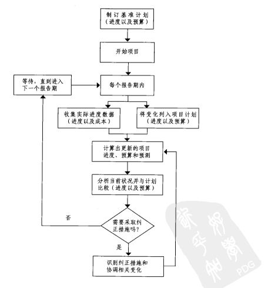

# 项目管理七杯茶

- 书名：《项目管理七杯茶》
- 作者： 夸克商学院
- 概要：治大国若烹小鲜，以喝茶做类比；阐述了项目管理的七个关键过程

## 这本书讲了什么

> 有时候我们做的工作如同一份刚刚及格的答卷，没有明显错误，但同样没有值得嘉奖的地方

### 第一杯茶：启动茶

> ”开始“不是做出来的，是说出来的

*重点*：背景分析、界定项目目的与目标、描述项目范围

*意义*：书面确立项目正式施行

*成果判定*：项目计划书

#### 项目计划书

**项目启动会**不仅决定了项目的大轮廓，更重要的是传递一种氛围，标志项目正式施行。（仪式感）

**项目计划书要点**

* 项目背景
  * 描述工作项目的提出原因、环境背景、优势及劣势分析、项目运作的可行性、项目的独特与创新分析、项目最终要取得的效果等
* 项目目的与目标
* 项目原则
  * 项目原则是对项目是否进行下去“是”与“非”的准则
  * 管理原则，是针对工作项目管理方向的是非判断，也是定性标准
  * 技术原则，是针对工作项目技术方向的是非判断，也是定量的标准
  * 项目原则的设定，最有效防止了“失误”的产生
  * 项目原则应该个性鲜明，要摒弃“假、大、空”的原则
  * 项目原则相当于执行工作的“宪法”，只要违背了项目原则，工作就不能继续下去
* 关键路径图
* 任务列表
* 关键问题分析
* 项目组成成员及时间投入

目的与目标的区别

* 目的是工作应达到的最终效果，而目标是达到最终效果的阶段性量化指标。常见错误是把过程描述为目的。

#### SMART目标定义原则

* Specific
* Measurable
* Attainable
* Relevant
* Time-based

### 第二杯茶：路径茶

*重点*：拆分关键任务、量化考核标准

*意义*：书面明确工作进程路线图

*成果判定*：项目执行路径图

#### 分解关键路径

项目目标确定之后，接下来就是确定执行那些工作要素来完成它

关键路径与非关键路径

里程碑的前置与后置

里程碑的描述

制定关键路径图：正推法和倒推法

#### 配置最优路径

任务信物

#### 路径优化六法

减少关键路径中的里程碑

调整路径排列，将串行变为并行

缩短早期任务

缩短最长任务

缩短最容易任务

缩短成本最少任务

### 第三杯茶：资源茶

*重点*：最小化预算、关键资源控制

*意义*：资金详细配给方案

*成果判定*：项目预算报表

#### 需要控制的成本

成本管理主要包括项目预算和成本使用监控两大方面

常见项目成本有:

* 人工成本
* 材料成本
* 分包成本
* 设备成本
* 差旅成本

#### 跟踪成本绩效成果

名词

* 累计预算成本
* 累计实际成本
* 盈余量=每项任务预算成本*完工比率
* 累计盈余量

#### 三个常用跟踪指标 

* 成本绩效指数=累计盈余量/累计实际成本
* 成本差异=累计 盈余量-累计实际成本
* 预测完工成本=总预算成本/成本绩效指数

#### 理性的成本控制方法

* 分析成本绩效，确定哪个任务模块需要采取纠正措施
* 研究决策采取哪些纠正措施
* 修正项目计划书，包括工期和成本预算，或者加入临时修正计划
* 成本差异负值最大的任务模块给予最高纠正优先级

### 第四杯茶：时间茶

*重点*：合理安排执行时间、滞后与提前时限处理、加班计划

*意义*：明确执行时限节点

*成果判定*：执行时间甘特图

> 学生综合征：人类倾向于浪费 时间的习惯，被称为学生综合征。正常人倾向于不由自主的拖延时间，尽可能拖延至最后的时刻
>
> 帕克森定律：工作总是拖延到它所能够允许最迟完成的那一天
>
> “不对称信息理论“研究有一个有趣现象：提前完成工作的人不会受到奖赏，反而会得到惩罚

#### 项目时间控制流程图

#### 到底该不该加班

对于高度不确定任务的工期预算，要通过三个维度进行计算：

* 乐观时间(Optimistic Time，To),

* 最可能时间(Most like Time,Tm)

* 悲观时间(Pessimistic Time,Tp)

期望工期

Te=(To+4Tm+Tp)/6

#### 加班的斜率

### 第五杯茶：人员茶

*重点*：项目经理权责界定、沟通与跨部门协作、明确项目团队成员责权利

*意义*：人力资源调配原则

*成果判定*：RACI责任矩阵图

#### 效率的来源

提高项目团队的工作效率，至少需要两种要素的相互配合，即职业的项目经理人和训练有素的项目团队成员

##### 项目经理人8种管理素养

1. 责任心与使命感
2. 分析与解决问题的能力
3. 领导能力
4. 沟通能力
5. 优先顺序设置能力
6. 计划能力
7. 团队精神
8. 创新能力

有效授权

##### 项目团队

项目团队四种状态

* 合作
* 震荡
* 信任
* 活力

##### RACI责任矩阵

* Responsible：执行人，实际做事的人
* Accountable：责任人，就是对项目结果负责的人，只有经过他同意，项目才能在关键环节得以进行
* Consulted：咨询人，在决策之前必须被征求意见的人，他的意见可以左右决策是否被执行，但最终需要责任人确认
* Informed：告知人，采取行动取得结果必须给告知的人，也是检验，评价结果的人，在执行过程中却不必向他征询意见

一个成功的项目经理人，并不是项目工作的监督者，而是通过执行工作，训练带领出一班素质过硬的团队，然后做出非同寻常的成绩。

### 第六杯茶：风险茶

> 善泳者溺于水

*重点*：衡量内外部风险、有效规避风险、紧急预案

*意义*：最大可能避免节外生技

*成果判定*：内外部风险控制计划书

#### 常见风险发生时期

在项目执行周期中，风险与机遇是动态变化的

常见的项目风险

1. 战略风险
2. 财务风险
3. 技术风险
4. 商业风险
5. 法务风险
6. 人事风险
7. 执行风险

#### 项目风险定性分析

* 有警告信息风险
* 有警告信息风向

故障树、风险树、鱼骨图

德尔菲法、专家会议法、情景分析法

#### 项目风险定量分析

进行定量分析，找到项目风险系数

#### 几种风险规避方法

* 风险规避：放弃使用有风险的项目资源、项目技术、项目方案等
* 风险遏制：遏制项目风险引发原因
* 风险转移
* 风险化解
* 风险容忍

风险识别、风险监控、风险应对、风险归档

### 第七杯茶：收尾茶

*重点*：成果评估准则、项目归档文件

*意义*：让有益的经验不断复制

*成果判定*：项目档案

将项目执行的过程、遇到的问题、面临的风险、克服的办法、判定的标准等整理成文档，以备日后工作参考

可以这样说，我们的所有工作都是为了获取如何得成果的档案，这是我们的最高目标，直至同类工作成功的概率为100%

#### 项目终止类别

* 绝对式终止
* 解散式终止
* 独立式终止
* 溢出式终止

#### 项目结束双要素

项目评估

项目存档模板

* 项目绩效档案
* 管理绩效档案
* 组织绩效档案
* 团队绩效档案
* 技术标准档案
* 边际效益档案

#### 文档参考

项目变更确认函

- 项目名称、项目编号、项目经理、项目类型
- 变更前后、变更原因

项目结束确认函

- 项目名称、项目编号、项目经理、项目类型

- 已达成目标
- 项目成果
- 启动日期、实际完成日期、 项目成本、人力成本

项目总结

- 项目名称、项目编号、部门、项目经理
- 项目背景
- 项目目的
- 项目成果与结论
- 核心发现
- 存在问题

## 我的理解

作者以茶类比项目管理，将项目管理的关键过程使用比较通俗的方式进行讲解，相比PMBOK没有那么枯燥。在应用到自己的项目中时要结合实际情况，对我来说最有用的三个工具是，smart目标定义原则，不确定工期任务管理以及raci责任矩阵。而风险管理中讲到的风险定量分析则很难应用，主要是因为风险系数评估没有适合自身评估模型可用，有待探索总结。